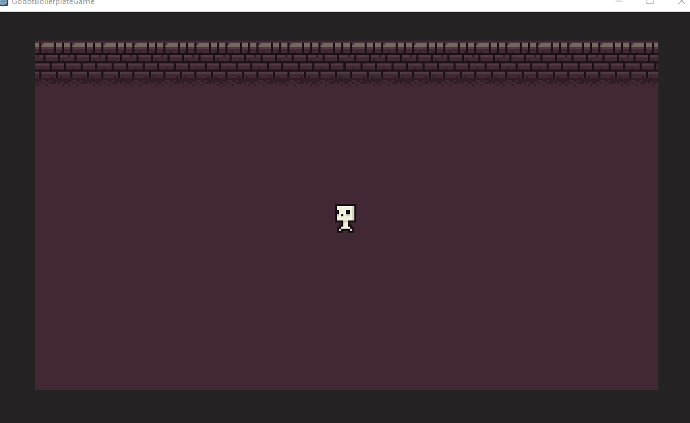

# Godot GDNative/C++ Boilerplate

This is a start boilerplate project for making games with Godot using GDNative/C++.

You can read more about how to set it up here: https://gamesencha.com/blog/post/2021-01-13/godot-gdnative-c-boilerplate

